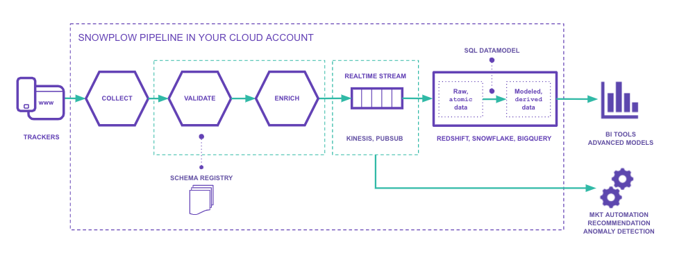

[![License][license-image]][license]
[![actively-maintained]][tracker-classificiation]


Snowplow is a scalable open-source platform for rich, high quality, low-latency data collection. It is designed to collect high quality, complete behavioural data for enterprise business.

# Snowplow Pipeline Overview



The [Snowplow trackers][tracker-docs] enable highly customisable collection of raw, unopinionated event data. The pipeline validates these events against a JSONSchema - to guarantee a high quality dataset - and adds information via both standard and custom enrichments.

This data is then made available in-stream for real-time processing, and can also be loaded to blob storage and data warehouse for analysis.

The Snowplow atomic data acts as an immutable log of all the actions that occurred across your digital products. The data model takes that data and transforms it into a set of derived tables optimized for analysis. [Visit our documentation site][docs-what-is-dm] for further explanation on the data modeling process.

# Repo Contents

- [Web (v1)](v1)
  - [Redshift](v1/redshift)
  - BigQuery (coming soon)
  - Snowflake (coming soon)
- Mobile (coming soon)
  - Redshift (coming soon)
  - BigQuery (coming soon)
  - Snowflake (coming soon)

Documentation for the data models can be found on [our documentation site][docs-data-models].

# Prerequisites

These models are written in a format that is runnable via [SQL-runner][sql-runner] - available for download from [Bintray][sql-runner-bintray].

They each also require a dataset of Snowplow events, generated by one of [the tracking SDKs][tracker-docs], passed through the validation and enrichment steps of the pipeline, and loaded to a database.

For the testing framework, Python3 is required. Install requirements with:

```bash
cd .tests
pip3 install -r requirements.txt
```

# Quickstart

To run a model and tests end to end, run the `.scripts/e2e.sh` bash script.


For a quickstart guide to each individual model, and specific details on each module, see the README in the model's database-specific folder (eg. `web/v1/redshift`).

For detail on the structure of a model, see the README in the model's main folder (eg. `web/v1`).

For detail on using the helper scripts, see the README in `.scripts/`

# Copyright and license

The Snowplow Data Models project is copyright 2020 Snowplow Analytics Ltd.

Licensed under the [Apache License, Version 2.0][license] (the "License");
you may not use this software except in compliance with the License.

Unless required by applicable law or agreed to in writing, software
distributed under the License is distributed on an "AS IS" BASIS,
WITHOUT WARRANTIES OR CONDITIONS OF ANY KIND, either express or implied.
See the License for the specific language governing permissions and
limitations under the License.

[license]: http://www.apache.org/licenses/LICENSE-2.0
[license-image]: http://img.shields.io/badge/license-Apache--2-blue.svg?style=flat
[tracker-classificiation]: https://docs.snowplowanalytics.com/docs/collecting-data/collecting-from-own-applications/tracker-maintenance-classification/
[actively-maintained]: https://img.shields.io/static/v1?style=flat&label=Snowplow&message=Actively%20Maintained&color=6638b8&labelColor=9ba0aa&logo=data:image/png;base64,iVBORw0KGgoAAAANSUhEUgAAABAAAAAQCAMAAAAoLQ9TAAAAeFBMVEVMaXGXANeYANeXANZbAJmXANeUANSQAM+XANeMAMpaAJhZAJeZANiXANaXANaOAM2WANVnAKWXANZ9ALtmAKVaAJmXANZaAJlXAJZdAJxaAJlZAJdbAJlbAJmQAM+UANKZANhhAJ+EAL+BAL9oAKZnAKVjAKF1ALNBd8J1AAAAKHRSTlMAa1hWXyteBTQJIEwRgUh2JjJon21wcBgNfmc+JlOBQjwezWF2l5dXzkW3/wAAAHpJREFUeNokhQOCA1EAxTL85hi7dXv/E5YPCYBq5DeN4pcqV1XbtW/xTVMIMAZE0cBHEaZhBmIQwCFofeprPUHqjmD/+7peztd62dWQRkvrQayXkn01f/gWp2CrxfjY7rcZ5V7DEMDQgmEozFpZqLUYDsNwOqbnMLwPAJEwCopZxKttAAAAAElFTkSuQmCC

[tracker-docs]: https://docs.snowplowanalytics.com/docs/collecting-data/collecting-from-own-applications/
[docs-what-is-dm]: https://docs.snowplowanalytics.com/docs/modeling-your-data/what-is-data-modeling/
[docs-data-models]: https://docs.snowplowanalytics.com/docs/modeling-your-data/

[sql-runner]: https://github.com/snowplow/sql-runner
[sql-runner-bintray]: https://bintray.com/snowplow/snowplow-generic/sql-runner#files