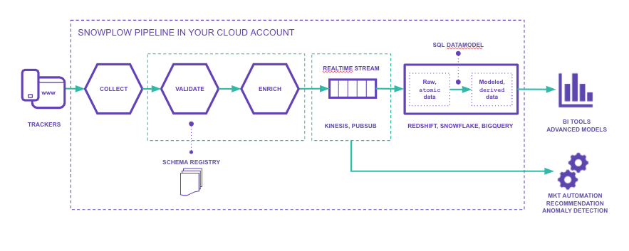

Snowplow is a scalable open-source platform for rich, high quality, low-latency data collection. It is designed to collect high quality, complete behavioural data for enterprise business.

# Snowplow Pipeline Overview

The [Snowplow trackers](https://docs.snowplowanalytics.com/docs/collecting-data/collecting-from-own-applications/) enable highly customisable collection of raw, unopinionated event data. The pipeline validates these events against a JSONSchema - to guarantee a high quality dataset - and adds information via both standard and custom enrichments.

This data is then made available in-stream for real-time processing, and can also be loaded to blob storage and data warehouse for analysis.

The SQL data models in this repo aggregate those raw events in-warehouse, to produce consumable datasets for analysis and actionable insight to be built upon. The models are built to allow the addition of custom use cases and aggregations, in a robust, scalable way.

# Prerequisites

These models are written in a format that is runnable via [SQL-runner](https://github.com/snowplow/sql-runner) - available for download from [Bintray](https://dl.bintray.com/snowplow/snowplow-generic/).

They each also require a dataset of Snowplow events, generated by one of [the tracking SDKs](https://docs.snowplowanalytics.com/docs/collecting-data/collecting-from-own-applications/), passed through the validation and enrichment steps of the pipeline, and loaded to a database.

For the testing framework, Python3 is required. Install requirements with:

`cd .tests`
`pip3 install -r requirements.txt`

# Quickstart

To run a model and tests end to end, run the `.scripts/e2e.sh` bash script.

For a quickstart guide to each individual model, and specific details on each module, see the README in the model's database-specific folder (eg. `web/v1/redshift`).

For detail on the structure of a model, see the README in the model's main folder (eg. `web/v1`).

For detail on using the helper scripts, see the README in `.scripts/`
