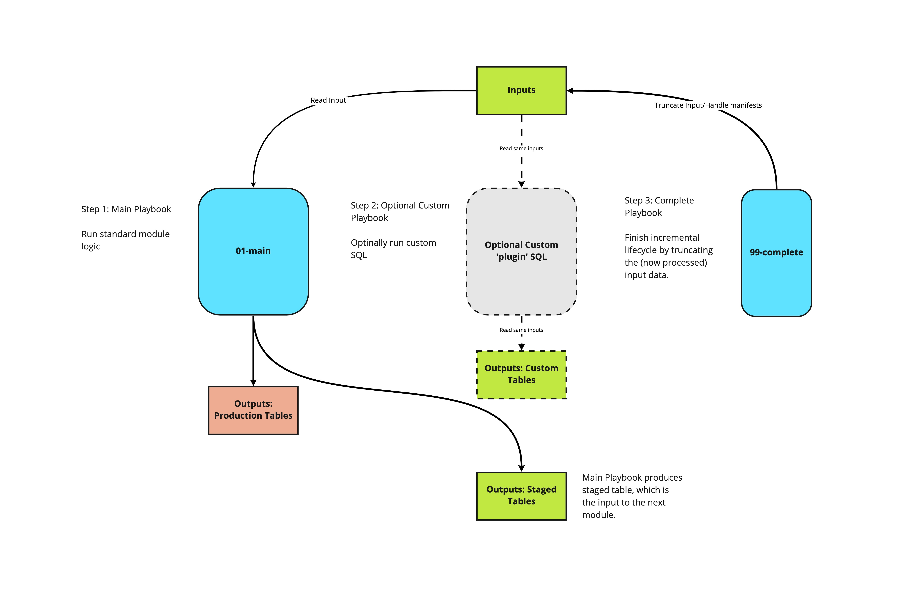
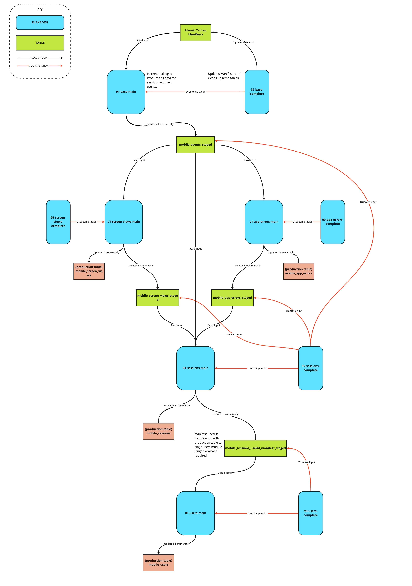

# Mobile model v1

This readme is an overview of the mobile v1 model's structure and logic. For documentation of the specific modules for each platform, and quickstart guides, see the README in the relevant database's directory.

## Overview

This model consists of a series of modules, each is idempotent and can be run on independent schedules, each produces a table which serves as the input to the next module.

The 'standard' modules can be thought of as source code for the core logic of the model, which Snowplow maintains. These modules carry out the incremental logic in such a way as custom modules can be written to plug into the model's structure, without needing to write a parallel incremental logic. We recommend that all customisations are written in this way, which allows us to safely maintain and roll out updates to the model, without impact on dependent custom sql.

Each module produces a table which acts as the input to the subsequent module (the `_staged` tables), and updates a production table - with the exception of the Base module, which takes atomic data as its input, and does not update a production table.

Each module comes with a `99-{module}-complete` playbook, which marks that module complete by updating any relevant manifests, cleaning up temporary tables and truncating the input (in the case of the sessions and users module). The complete steps may be run at the end of each module, or at the end of the run.

More detail on each module can be found in the README of each individual model's `sql-runner` directory.

Custom modules can fit into the incremental structure by consuming the same inputs, and running before the `99-{module}-complete` playbook runs.

Custom modules may also consume and intermediary tables of the standard module, which will not be dropped until the `99-{module}-complete` playbook runs.

Any custom sql that depends on a `_staged` table as its input should run before the `complete` step of the module which handles that same input. For example, custom logic which takes `mobile_events_staged` as an input should run before the `99-sessions-complete` playbook, which truncated `mobile_events_staged`.

As an introductory example, if there is a requirement to include data from custom events and entities for screen views, for example, we would write a custom module which:

- Reads events/event_ids from the scratch.mobile_events_staged table
- Aggregates to one-row-per screen_view_id.
- Delete-inserts this to a custom table which can join to the derived.mobile_screem_views table on screen_view_id.

If the playbook for this custom module is called `AA-my-custom-screen-views-level-module.yml.tmpl`, then we would run the playbooks as follows:

1. standard/01-base/01-base-main.yml.tmpl
2. standard/02-screen-views/01-screen-views-main.yml.tmpl
3. custom/AA-my-custom-screen-views-level-module.yml.tmpl
4. standard/01-base/99-base-complete.yml.tmpl
5. standard/02-screen-views/99-screen-views-complete.yml.tmpl

Custom modules can also be created with their own independent manifesting logic, in which case they are more complex, but don't rely on the standard modules.

## Metadata

Metadata is logged in the `{{.output_schema}}.datamodel_metadata{{.entropy}}` table, per-module and per-run. A persistent ID is created, so that separate modules within the same run may be identified. This ID is automatically handled, as long as the `99-{module}-complete` step of the last module to run has the `:ends_run:` variable set to `false`.

Rather than setting this variable, this can be maintained manually be running the `00-setup/00-setup-metadata.yml.tmpl` before all other steps, and the `00-setup/99-complete-metadata.yml.tmpl` playbook after all other steps.
