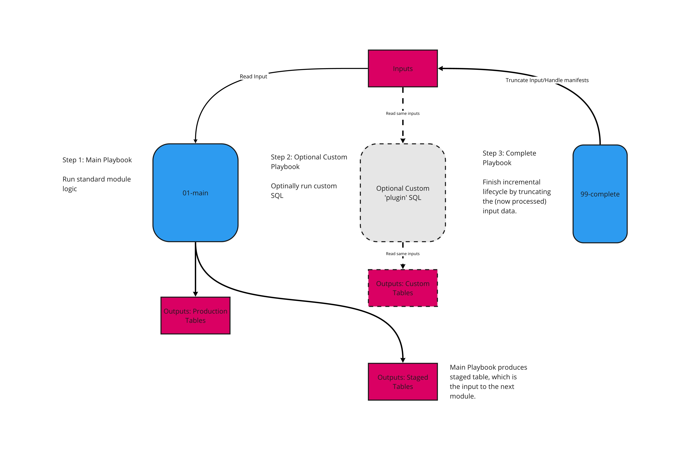
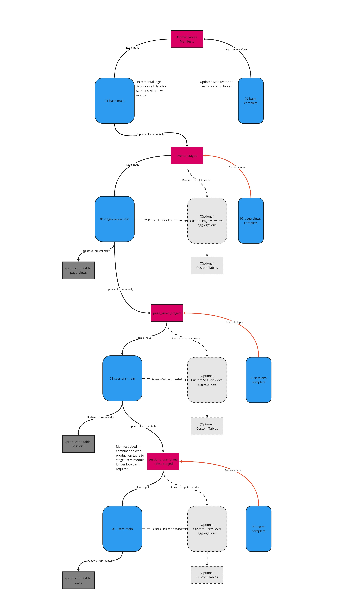

# Redshift v1 model README

This readme is an overview of the model's logic and how the modules interact with each other. For a guide to configuring each module, there is a README in each of the modules' `playbooks` directory.

To customise the model, we recommend following the guidance found in the README in the `sql/custom` directory.

## Overview

This model consists of a series of modules, each is idempotent and can be run on independent schedules, each produces a table which serves as the input to the next module.

The 'standard' modules can be thought of as source code for the core logic of the model, which Snowplow maintains. These modules carry out the incremental logic in such a way as custom modules can be written to plug into the model's structure, without needing to write a parallel incremental logic. We recommend that all customisations are written in this way, which allows us to safely maintain and roll out updates to the model, without impact on dependent custom sql.

Each module produces a table which acts as the input to the subsequent module (the `_staged` tables), and updates a production table - with the exception of the Base module, which takes atomic data as its input, and does not update a production table.

Each module comes with a `99-{module}-complete` playbook, which marks that module complete by updating any relevant manifests, and truncating the input, and cleaning up temporary tables. The complete steps may be run at the end of each module, or at the end of the run.

More detail on each module can be found in the 'Modules detail' section below.

Custom modules can fit into the incremental structure by consuming the same inputs, and running before the `99-{module}-complete` playbook runs.

Custom modules may also consume and intermediary tables of the standard module, which will not be dropped until the `99-{module}-complete` playbook runs.

Any custom sql that depends on a `_staged` table as its input should run before the `complete` step of the module which handles that same input. For example, custom logic which takes `events_staged` as an input should run before the `99-page-views-complete` playbook.

As an introductory example, if there is a requirement to include data from custom events and entities for page views, for example, we would write a custom module which:

- Reads events/event_ids from the derived.events_staged table
- Aggregates to one-row-per page_view_id.
- Delete-inserts this to a custom table which can join to the derived.page_views table on page_view_id.

If the playbook for this custom module is called `AA-my-custom-page-views-level-module.yml.tmpl`, then we would run the playbooks as follows:

1. standard/01-base/01-base-main.yml.tmpl
2. standard/01-base/99-base-complete.yml.tmpl
3. standard/02-page-views/01-page-views-main.yml.tmpl
4. custom/AA-my-custom-page-views-level-module.yml.tmpl
5. standard/02-page-views/99-page-views-complete.yml.tmpl

Custom modules can also be created with their own independent manifesting logic, in which case they are more complex, but don't rely on the standard modules.

## Metadata

Metadata is logged in the `{{.output_schema}}.web_model_run_metadata{{.entropy}}` table, per-module and per-run. A persistent ID is created, so that separate modules within the same run may be identified. This ID is automatically handled, as long as the `99-{module}-complete` step of the last module to run has the `:ends_run:` variable set to `false`.

Rather than setting this variable, this can be maintained manually be running the `00-setup/00-setup-metadata.yml.tmpl` before all other steps, and the `00-setup/99-complete-metadata.yml.tmpl` playbook after all other steps.

## Modules detail

### 01-base

Inputs:             atomic tables, `{{.output_schema}}.base_event_id_manifest`, `{{.output_schema}}.base_session_id_manifest`

Persistent Outputs: `{{.scratch_schema}}.events_staged`,

Temporary Outputs:  `{{.scratch_schema}}.events_this_run`, `{{.scratch_schema}}.base_duplicates_this_run`

The base module executes the incremental logic of the model - it retrieves all events for sessions with new data, deduplicates, and adds the page_view_id.

The base module's 'complete' playbook (`99-base-complete.yml.tmpl`) updates the two relevant manifests, and cleans up temporary tables. The lifecycle of the `{{.scratch_schema}}.events_staged` table is completed by the `99-page-views-complete.yml.tmpl` step (of the subsequent module).

A record of the duplicates removed for the run is logged in the `{{.scratch_schema}}.base_duplicates_this_run` table. Note that the base_duplicates_this_run table is dropped and recomputed every run, users interested in permanently logging them should create a custom module to handle this.

The `{{.scratch_schema}}.events_this_run` table contains all events relevant only to this run of the model (since the last time the `99-base-complete.yml.tmpl` playbook has run). This table is dropped and recomputed _every_ run of the module, regardless of whether another module has used the data.

If there is a requirement that a custom module consumes data _more frequently than the page views module_, the `{{.scratch_schema}}.events_this_run` table may be used for this purpose.

The `{{.scratch_schema}}.events_staged` table is incrementally updated to contain all events relevant to any run of the base module _since the last time the page views module consumed it_ (ie since the last time the `99-page-views-complete.yml.tmpl` has run). This allows one to run the base module more frequently than the page views module (if, for example, a custom module reads from events_this_run).

Detail on configuring the base module's playbook can be found [in the relevant playbook directory's README](sql-runner/playbooks/standard/01-base).

### 02-page-views

Inputs:             atomic tables, `{{.scratch_schema}}.events_staged`

Persistent Outputs: `{{.output_schema}}.page_views`, `{{.scratch_schema}}.page_views_staged`

Temporary Outputs:  `{{.scratch_schema}}.page_views_this_run`, `{{.scratch_schema}}.pv_page_view_id_duplicates_this_run`

The page views module takes `{{.scratch_schema}}.events_staged` as its input, deduplicates on page_view_id, calculates the standard page views model, and updates the production page_views table. It also produces the `{{.scratch_schema}}.page_views_staged` and `{{.scratch_schema}}.page_views_this_run` tables.

The page views module's 'complete' playbook `99-page-views-complete.yml.tmpl` truncates the `{{.scratch_schema}}.events_staged` table, and cleans up temporary tables. The lifecycle of the `{{.scratch_schema}}.page_views_staged` table is completed by the `99-sessions-complete.yml.tmpl` step (of the subsequent module).

A record of the duplicates removed for the run is logged in the `{{.scratch_schema}}.pv_page_view_id_duplicates_this_run` table. Note that the `{{.scratch_schema}}.pv_page_view_id_duplicates_this_run` table is dropped and recomputed every run, users interested in permanently logging them should create a custom module to handle this.

The `{{.scratch_schema}}.page_views_this_run` table contains all events relevant only to this run of the model (since the last time the `99-page-views-complete.yml.tmpl` playbook has run). This table is dropped and recomputed _every_ run of the module, regardless of whether another module has used the data.

If there is a requirement that a custom module consumes data _more frequently than the sessions module_, the `{{.scratch_schema}}.page_views_this_run` table may be used for this purpose.

The `{{.scratch_schema}}.page_views_staged` table is incrementally updated to contain all events relevant to any run of the page views module _since the last time the sessions module consumed it_ (ie since the last time the `99-sessions-complete.yml.tmpl` playbook has run). This allows one to run the page views module more frequently than the sessions module (if, for example, a custom module reads from page_views_this_run).

The page views module also contains optional add-on steps. These can be configured to run or not based on which enrichments the user has enabled, and wishes to include in the model.

Detail on configuring the page views module's playbook can be found [in the relevant playbook directory's README](sql-runner/playbooks/02-page-views).

### 03-sessions

Inputs:             `{{.scratch_schema}}.page_views_staged`

Persistent Outputs: `{{.output_schema}}.sessions`, `{{.scratch_schema}}.sessions_userid_manifest_staged`

Temporary Outputs:  `{{.scratch_schema}}.sessions_this_run`

The sessions module takes `{{.scratch_schema}}.page_views_staged` as its input, calculates the standard sessions model, and updates the production sessions table. It also produces the `{{.scratch_schema}}.sessions_userid_manifest_staged` and `{{.scratch_schema}}.sessions_this_run{{.entropy}}` tables.

Unlike the other modules, the sessions module outputs a manifest of IDs as its staged table rather than a table containing all unprocessed data - this is due to the fact that the users step requires a longer lookback than the incremental structure contains, so there are obviously efficiency limitations.

The sessions module's 'complete' playbook `99-sessions-complete.yml.tmpl` truncates the `{{.scratch_schema}}.page_views_staged` table, and cleans up temporary tables. The lifecycle of the `{{.scratch_schema}}.sessions_userid_manifest_staged` table is completed by the `99-users-complete.yml.tmpl` step (of the subsequent module).

The `{{.scratch_schema}}.sessions_this_run` table contains all events relevant only to this run of the model (since the last time the `99-sessions-complete.yml.tmpl` playbook has run). This table is dropped and recomputed _every_ run of the module, regardless of whether another module has used the data.

If there is a requirement that a custom module consumes data _more frequently than the users module_, the `{{.scratch_schema}}.sessions_this_run` table may be used for this purpose.

The `{{.scratch_schema}}.sessions_userid_manifest_staged` table is incrementally updated to contain all IDs relevant to any run of the sessions module _since the last time the users module consumed it_ (ie since the last time the `99-users-complete.yml.tmpl` playbook has run). This allows one to run the sessions module more frequently than the users module (if, for example, a custom module reads from sessions_this_run and is more frequent than the page views module).

Detail on configuring the sessions module's playbook can be found [in the relevant playbook directory's README](sql-runner/playbooks/03-sessions).

### 04-users

Inputs:             `{{.scratch_schema}}.sessions_userid_manifest_staged`, `{{.output_schema}}.users_manifest`

Persistent Outputs: `{{.output_schema}}.users`

Temporary Outputs:  `{{.scratch_schema}}.users_this_run`

The sessions module takes `{{.scratch_schema}}.sessions_userid_manifest_staged` as its input, alongside the `{{.output_schema}}.users_manifest` table (which is self-maintained within the users module). It calculates the standard users model, and updates the production users table. It also produces the `{{.scratch_schema}}.users_this_run` table.

Unlike the other modules, the users module doesn't take an input that contains all information required to run the module. It uses the `{{.output_schema}}.users_manifest` table to manage efficiency, and queries the sessions table to process data as far back in history as is required.

The users module's 'complete' playbook `99-users-complete.yml.tmpl` truncates the `{{.scratch_schema}}.sessions_userid_manifest_staged` table, commits to the `{{.output_schema}}.users_manifest` and cleans up temporary tables. There is no `_staged` table for this module, as there are no subsequent modules.

The `{{.scratch_schema}}.users_this_run` table contains all events relevant only to this run of the model (since the last time the `99-users-complete.yml.tmpl` playbook has run). This table is dropped and recomputed _every_ run of the module, regardless of whether another module has used the data.

Detail on configuring the users module's playbook can be found [in the relevant playbook directory's README](sql-runner/playbooks/04-users).

## A note on duplicates

This version of the model (1.0.0) excludes duplicated event_ids and page_view_ids. Ideally in the future it will provide standard options for handling them, however because customisations of this model involve queries on federated atomic tables, the safest option for a first version is to exclude them.

If there is a need to handle duplicates, this can be done by adding a custom module to the base level of aggregation - take good care to manage the possibility of introducing duplicates downstream if doing so.

Normally, one would expect less than 1% duplicates in the dataset. If the requirement to handle duplicates arises from the fact that there is a large proportion of them, users are advised to first investigate the source of duplicates and attempt to address the issue upstream of the data models - a high proportion of duplicates can be indicative of a more significant issue in tracking or configuration of the pipeline.
